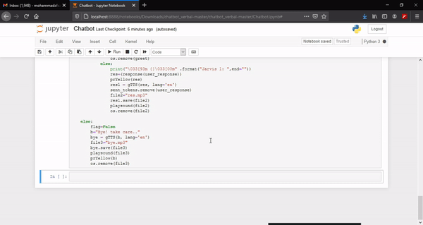
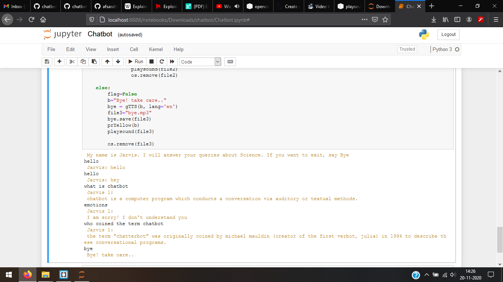

# chatbot


Python voice chatbot using NLTK , Speech Recognition  , Google text-to-speech , Scikit-learn 
## Quick Start Using Pip
----------------------------------------------------------------------------------------------------------------------------------------------------------

``` bash

# Install dependencies
$ pip install -r requirements.txt

```
----------------------------------------------------------------------------------------------------------------------------------------------------------

### key steps include

    Backend Corpus serving as Bot’s knowledge base.
    User initializing verbal input via a microphone
    Conversion of input query information into respective text form.
    Classification of input type using Naive Bayes between question or emotion type.
    Processing of input using NLP & Computing answers from the Corpus.
    Computing best possible answers via TF-IDF score between question and answers for Corpus
    Conversion of best Answer into Voice output.
    
----------------------------------------------------------------------------------------------------------------------------------------------------------


### working of Chatbot
We will write a function to classify user input, which uses nps_chat corpora and naive Bayes classifier to categorize the input type by classifying them into listed categories.Where else Bot will answer only to Question type classes.
<br>
We will call Corpus of our chatbot and perform some NLP pre-processing steps on it, i.e., Sentence and Word Tokenization, Lemmatization, Normalisation. We are calling our Corpus as intro_join. Here We have taken an article from Wikipedia about a fungal disorder Tinea pedis (athlete’s foot) pasted into the text file. You can use your choice data by merely placing it in a file named “data”
<br>
we will create a function for processing the user response converting it into a vectorized form and get the best result from Corpus via computing TF-IDF cosine similarity between the question and answer.<br>

 It is using speech recognition for registering user input using the microphone. Converting it into text form, Searching for its answers from the processed Corpus, and returning the output using text-to-speech. It will continue taking user input and answering until the user says Bye/Goodbye.

----------------------------------------------------------------------------------------------------------------------------------------------------------

``` bash
# To Run the program
>> python Chatbot.py

```


# chatbot
